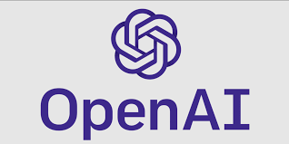

 
# ChatGPT Clone for Web Server

An easy-to-install ChatGPT clone you can host on your own web server.

### Pre-requisites

You will need the following in order to use this application:

1. An OpenAI API key
2. Web Hosting
3. A Domain Name


## Getting Started

Step 1. Download the source zip file.
Step 2. Extract the source files from the zip to a local directory.
Step 3. Add your OpenAI API key to the chat.php file:

```
// Add your OpenAI API Key below 
$chat = new ChatGPT([
    'api_key' => 'OPENAI_API_KEY_GOES_HERE',	
]);
```

Step 4. Upload the source files to the root directory of your public HTML web server.
Step 5. Enjoy your personal ChatGPT clone!


### Additional (Optional) Configurations & Notes
To protect your OpenAI API key from being used by the general public, I suggest you incorporate a password or page protection on your Chat's URL through your web host. Most web hosts allow you to password protect specified directories directly from your host dashboard.

If you want to activate a welcome splash screen at first startup:

1. Go to the pref.js file in the static/js directory
2. Remove the comment lines from the following code and change text as necessary:

```
/*
if (localStorage.getItem('isFunctionCalled') === 'true') {
  console.log('Function Called');
} else {
  console.log('Call Function');
  window.onload = function() {
    var div = document.getElementById("messages");
    div.innerHTML = `<div style="margin: auto; width: 50%; align-items: center;"><div class="user">
                <p>&nbsp;</p>
        </div>
                <div class="content"> 
                    <p><b>Hi!</b></p>
                    <p>&nbsp;</p>
                    <p>I am Open AI ChatGPT.</p>
                    <p>&nbsp;</p>
                    <p>I will gladly answer all questions.</p>
                </div></div>`;
    setTimeout(function() {
      div.innerHTML = "";
    }, 3000);
  }
  localStorage.setItem('isFunctionCalled', 'true');
}
*/
```

### Running the Application

Once the files have been uploaded to your root directory (or sub-domain or directory), simply navivate to your URL to access the chat from your browser.

Note: Defaults to model 3.5 if you don't have access to the GPT-4 API, regardless of which model you choose.

### Credit

Most of this was put together by <a href="https://github.com/alexsky177/chatgpt">@alexsky177</a>.
I just added web access and model choices, and removed the default splash pop-up. 

Files are a combination of the following projects:
HTML & CSS: https://github.com/xtekky/chatgpt-clone
PHP Classes: https://github.com/qiayue/php-openai-gpt-stream-chat-api-webui

